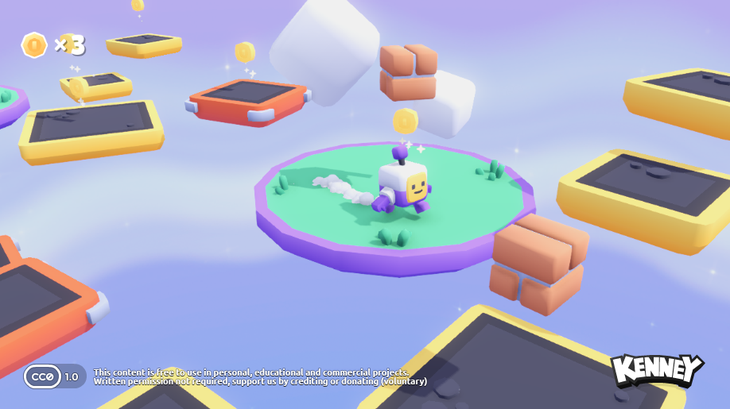

# Starter Kit 3D Platformer

A small Godot 4.6 3D platformer prototype focused on Steam Deck-friendly local play. The game supports one to four local players, collectable coins, falling platforms, split-screen views, score entry, and controller-first menus.

This project is currently intended for local installs and testing. It is not published on Steam and does not require Steamworks, an app ID, or the Steam Direct fee.

## Current Features

- Local one to four player mode selected from the start screen
- Split-screen camera layout for active player slots
- Gamepad movement and jumping
- In-game pause menu with Resume, Main Menu, and Quit
- Coin collection and per-player HUD counters
- End-of-run initials entry and scoreboard flow
- Steam Deck detection UI on the start screen
- 1280x800 default viewport, matching Steam Deck's native aspect ratio

## Steam Deck Local Install

For local testing, export a build and copy it to the Steam Deck.

Recommended package options:

- Linux export: preferred if the native build launches cleanly on SteamOS.
- Windows export: usable through Proton if the Linux export has issues.

Manual install flow:

1. Switch the Steam Deck to Desktop Mode.
2. Copy or download the exported game folder.
3. Open Steam in Desktop Mode.
4. Choose Games > Add a Non-Steam Game to My Library.
5. Select the game executable.
6. Return to Gaming Mode and launch it from the Non-Steam tab.

For a Windows export, open the game's Steam shortcut properties and enable a Proton compatibility tool if it does not launch automatically.

## Controls

Gamepad:

- Left stick or D-pad: move
- A button: jump and activate focused menu buttons
- Start: pause menu

Keyboard:

- WASD: move player 1
- Space: jump player 1
- Escape: pause menu

The project currently uses fixed Godot input actions for player slots 1-4. This works for basic local testing, but controller assignment should be made dynamic before a public Steam Deck release.

## Steam Deck Compatibility Target

The goal is a controller-first experience that can be played from Gaming Mode without needing a keyboard or mouse.

Current compatibility status:

- Resolution: default project viewport is 1280x800.
- Menus: start screen, pause menu, and game-over menu are controller navigable.
- Text entry: initials entry has an on-screen keyboard scene, but it still needs full multi-player focus testing.
- Pause/quit: in-game pause menu is available through Escape and gamepad Start.
- Multiplayer: inactive player slots are disabled when fewer than four players are selected.
- Performance: no dedicated Steam Deck FPS/battery profile yet.
- Packaging: no Linux/Windows release ZIPs are currently included in the repo.

## Known Constraints

These are the fragile areas to address before treating the game as Steam Deck-ready:

- Controller devices are statically mapped in `project.godot`. Steam Deck plus external controllers can reorder device IDs, so player slots should be assigned from connected joypads at runtime.
- UI button labels are plain text prompts. Replace them with controller glyphs or context-aware prompts before a polished public release.
- The initials entry flow has hardcoded focus paths and comments noting multiplayer input issues. It should be tested with only controllers connected.
- Player scenes are duplicated as `player.tscn`, `player2.tscn`, `player3.tscn`, and `player4.tscn`. A single player scene with per-slot color/material setup would be easier to maintain.
- The scoreboard and initials screens are duplicated per viewport. This works, but changes are easy to miss across all four slots.
- There is no in-game graphics/performance option for FPS cap, render scale, or battery-friendly mode.
- The Steam Deck executable packaging and install instructions still need to be tested on real hardware.

## Development Notes

Useful files:

- `project.godot`: input map, viewport size, autoloads, main scene
- `scenes/startgui.tscn`: start screen and player count selector
- `scenes/main.tscn`: world, four player slots, viewports, HUDs, score entry instances
- `scenes/main.gd`: split-screen visibility, active player slot handling, pause menu
- `scripts/player.gd`: movement, jumping, coin collection, score entry trigger
- `scenes/initialsentry.tscn`: initials entry and on-screen keyboard

Recommended next compatibility work:

1. Add a controller/player assignment manager.
2. Replace static player input actions with per-device runtime mapping.
3. Clean up start/game-over button prompt text.
4. Test initials entry with only gamepad input.
5. Add a Steam Deck performance preset or FPS cap.
6. Export both Linux and Windows builds and test launch from Gaming Mode.

## Screenshot

# Based on Kenney's 3D Platformer Starter Kit:
# Starter Kit 3D Platformer

This package includes a basic template for a 3D platformer game in Godot 4.2.2.stable.official. Includes features like;

- Character controller (with double jump)
- Collectable coins and falling platforms
- Camera controls (rotate, zoom)
- Gamepad support
- Sprites and 3D Models _(CC0 licensed)_
- Sound effects _(CC0 licensed)_

## License

MIT License

Copyright (c) 2024 Kenney

Permission is hereby granted, free of charge, to any person obtaining a copy of this software and associated documentation files (the "Software"), to deal in the Software without restriction, including without limitation the rights to use, copy, modify, merge, publish, distribute, sublicense, and/or sell copies of the Software, and to permit persons to whom the Software is furnished to do so, subject to the following conditions:

The above copyright notice and this permission notice shall be included in all copies or substantial portions of the Software.

THE SOFTWARE IS PROVIDED "AS IS", WITHOUT WARRANTY OF ANY KIND, EXPRESS OR IMPLIED, INCLUDING BUT NOT LIMITED TO THE WARRANTIES OF MERCHANTABILITY, FITNESS FOR A PARTICULAR PURPOSE AND NONINFRINGEMENT. IN NO EVENT SHALL THE AUTHORS OR COPYRIGHT HOLDERS BE LIABLE FOR ANY CLAIM, DAMAGES OR OTHER LIABILITY, WHETHER IN AN ACTION OF CONTRACT, TORT OR OTHERWISE, ARISING FROM, OUT OF OR IN CONNECTION WITH THE SOFTWARE OR THE USE OR OTHER DEALINGS IN THE SOFTWARE.

Assets included in this package (2D sprites, 3D models and sound effects) are [CC0 licensed](https://creativecommons.org/publicdomain/zero/1.0/).
